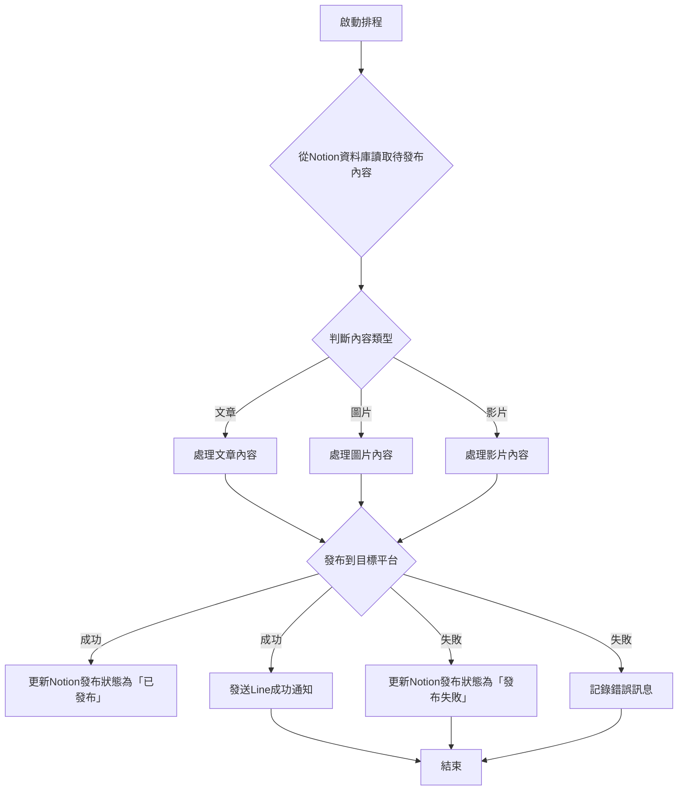

# 自動化發文系統架構設計

## 1. 系統目標

本系統旨在實現將Notion資料庫中的文章、圖片或影片自動發布到Instagram、Facebook、Threads等社群媒體平台，並在發布成功後透過Line發送通知給用戶，以提高內容發布效率並減少人工操作。

## 2. 核心功能

*   **Notion資料擷取**：定期從Notion資料庫中讀取待發布的內容（文章、圖片、影片）。
*   **內容類型判斷**：根據Notion資料庫中的內容屬性，判斷內容類型（文字、圖片、影片）。
*   **資料轉換與處理**：將Notion中擷取的資料轉換為各社群媒體平台所需的格式，包括圖片壓縮、影片轉碼、文字格式調整等。
*   **社群媒體發布**：透過各平台的API將處理後的內容發布到Instagram、Facebook、Threads。
*   **Line通知**：發布成功後，透過Line Messaging API向用戶發送成功通知。
*   **錯誤處理與日誌記錄**：記錄系統運行日誌，並處理發布過程中可能出現的錯誤。

## 3. 技術選型

*   **Notion API**：用於從Notion資料庫中讀取內容。
*   **Instagram Graph API**：用於在Instagram上發布圖片和影片。
*   **Facebook Graph API**：用於在Facebook上發布文章、圖片和影片。
*   **Threads API**：用於在Threads上發布內容。
*   **Line Messaging API**：用於發送Line通知。
*   **程式語言**：Python (考慮其豐富的API客戶端庫和易用性)。
*   **排程工具**：考慮使用Cron Job或雲端函數服務（如Google Cloud Functions, AWS Lambda）進行定期觸發。

## 4. 資料庫設計 (Notion)

Notion資料庫需要包含以下關鍵欄位，以便系統正確識別和處理內容：

*   **標題 (Title)**：文章標題或貼文標題。
*   **內容 (Content)**：文章正文或貼文文字內容。
*   **媒體類型 (Media Type)**：下拉選單，選項包括「文章」、「圖片」、「影片」。
*   **媒體URL (Media URL)**：圖片或影片的URL（如果媒體類型為圖片或影片）。
*   **發布狀態 (Publish Status)**：下拉選單，選項包括「草稿」、「待發布」、「已發布」、「發布失敗」。
*   **發布日期 (Publish Date)**：預計發布日期和時間。
*   **目標平台 (Target Platforms)**：多選選單，選項包括「Instagram」、「Facebook」、「Threads」。
*   **Line通知狀態 (Line Notification Status)**：下拉選單，選項包括「未發送」、「已發送」、「發送失敗」。
*   **錯誤訊息 (Error Message)**：記錄發布失敗時的錯誤訊息。

## 5. 自動化流程圖

## 6. 資料轉換與處理細節

### 6.1. 文章內容

*   **Notion to Text**：將Notion頁面內容轉換為純文字或Markdown格式。
*   **Facebook**：直接發布文字內容。
*   **Instagram/Threads**：由於主要為視覺內容平台，文章內容將作為圖片或影片的說明文字。

### 6.2. 圖片內容

*   **Notion圖片URL擷取**：從Notion資料庫中獲取圖片URL。
*   **圖片下載**：下載圖片到本地暫存。
*   **圖片格式檢查與轉換**：確保圖片為JPEG格式（Instagram要求），必要時進行轉換。
*   **圖片尺寸與比例調整**：根據Instagram和Facebook的要求，調整圖片尺寸和長寬比（例如Instagram要求4:5到1.91:1之間）。
*   **圖片壓縮**：壓縮圖片大小以符合平台限制（例如Instagram最大8MB）。

### 6.3. 影片內容

*   **Notion影片URL擷取**：從Notion資料庫中獲取影片URL。
*   **影片下載**：下載影片到本地暫存。
*   **影片格式檢查與轉碼**：確保影片為MP4或MOV格式（Instagram要求），必要時進行轉碼。
*   **影片尺寸與比例調整**：根據Instagram和Facebook的要求，調整影片尺寸和長寬比。
*   **影片長度與大小檢查**：檢查影片長度（例如Instagram Reels最長15分鐘，Stories最長60秒）和檔案大小（例如Instagram Reels最大300MB，Stories最大100MB）。
*   **生成影片封面**：為影片生成封面圖片。

## 7. 社群媒體發布細節

### 7.1. Instagram

*   **API類型**：使用Instagram Graph API。
*   **帳號要求**：需要Instagram商業帳號或創作者帳號，並連結到Facebook專頁。
*   **發布流程**：
    1.  創建媒體容器 (Media Container)。
    2.  上傳媒體到容器。
    3.  發布容器。
*   **限制**：每個帳號24小時內最多發布25個API發布的貼文。

### 7.2. Facebook

*   **API類型**：使用Facebook Graph API。
*   **發布內容**：可發布文字、圖片、影片。
*   **發布流程**：直接透過API發送POST請求。
*   **限制**：API請求有速率限制，需注意。

### 7.3. Threads

*   **API類型**：使用Threads API (基於Graph API)。
*   **發布內容**：可發布文字、圖片、影片。
*   **發布流程**：與Instagram和Facebook類似，透過API發送POST請求。
*   **限制**：與Instagram類似，每個帳號24小時內最多發布25個API發布的貼文。

## 8. Line通知細節

*   **API類型**：使用Line Messaging API。
*   **通知內容**：發布成功後，發送包含發布內容標題、目標平台和發布時間的通知訊息。
*   **認證**：需要Line Channel Access Token。

## 9. 錯誤處理與日誌記錄

*   **日誌記錄**：詳細記錄每次執行結果，包括成功、失敗、錯誤訊息等。
*   **重試機制**：對於暫時性錯誤（如API速率限制），考慮實施重試機制。
*   **通知機制**：發布失敗時，除了Line通知外，可考慮額外發送郵件或記錄到特定日誌系統。

## 10. 部署考量

*   **環境**：考慮使用雲端服務（如Google Cloud Functions, AWS Lambda, Azure Functions）來部署無伺服器函數，實現自動化排程觸發。
*   **安全性**：API金鑰和敏感資訊應妥善保管，使用環境變數或密碼管理服務。
*   **擴展性**：設計時考慮未來可能增加的社群媒體平台或Notion資料庫數量。

## 11. 未來擴展

*   支援更多社群媒體平台（如X, TikTok）。
*   支援更多Notion內容類型（如PDF文件）。
*   提供更詳細的發布報告和數據分析。
*   建立Web介面供用戶管理和監控自動化流程。

---

